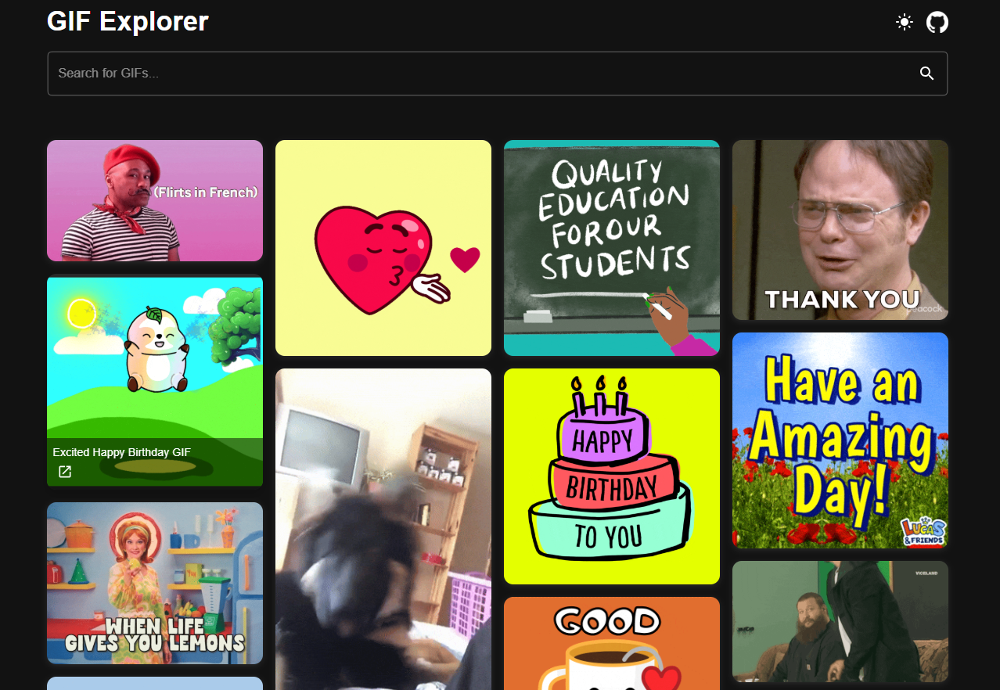

# **GIF Explorer**

A fast and modular React app to search and save animated GIFs using the Giphy API.
_Built for onboarding clarity, UI empathy, and scalable architecture._



---

## Live Demo

Explore the app live on Vercel:  
🔗 [gif-explorer.vercel.app](https://gif-explorer.vercel.app)

---

## **Description**

GIF Explorer is a **modular and emotionally intelligent** React application that lets users search and save animated GIFs using the Giphy API. It demonstrates best practices in frontend development, including Context API for **lightweight global state**, performance optimization with `useMemo` and `useCallback`, and a **responsive UI built with reusable, teachable components**.

This project is part of my portfolio to showcase **editorial clarity**, **emotionally aware UI feedback**, and **scalable architecture** using modern React tools.

---

### **Key Features**

- **Real-time GIF search** powered by the Giphy API
- **Dark/light mode toggle** with persistent theme memory
- **Global state management** using Context API and custom hooks
- **Modular components** designed for onboarding and editorial clarity
- **Planned emotional feedback**: ErrorMessage, EmptyState, SuccessToast

This project is part of my portfolio to **demonstrate clean, maintainable frontend development** with a focus on emotional UX.

---

## Technologies Used

- **React:** Component-based user interface
- **Vite:** Fast build tool and development server
- **Context API:** Lightweight global state management
- **Material UI:** Accessible, responsive UI components
- **Fetch API:** Async data fetching from Giphy
- **useMemo & useCallback:** Performance optimization for rendering

---

## **Getting Started**

### **Installation & Setup**

Follow these steps to run the project locally:

1. Clone the repository:

   ```bash
   git clone https://github.com/maitepv87/gif-explorer.git
   cd gif-explorer

   ```

2. Install dependencie:

   ```bash
   npm install
   ```

3. Set up environment variables in a .env file:

   ```ini
   VITE_API_URL=https://api.giphy.com/v1/gifs
   VITE_API_KEY=your_giphy_api_key
   ```

4. Start the development server:

   ```bash
   npm run dev
   ```

Then open http://localhost:3000 in your browser.

This project is designed to be teachable, modular, and emotionally clear — perfect for onboarding and portfolio review.
